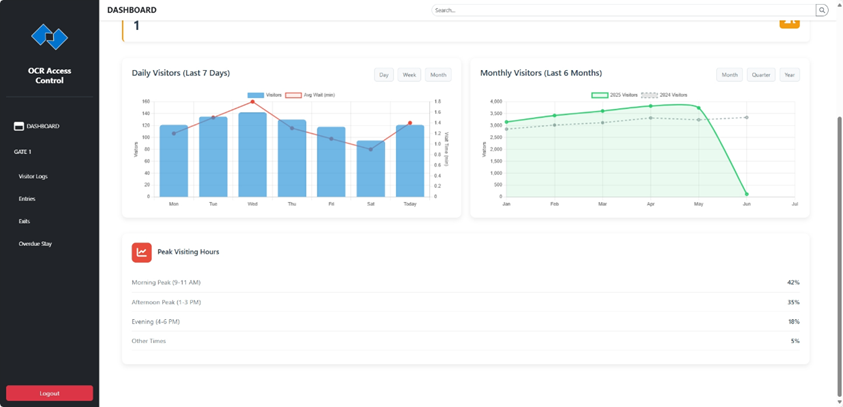
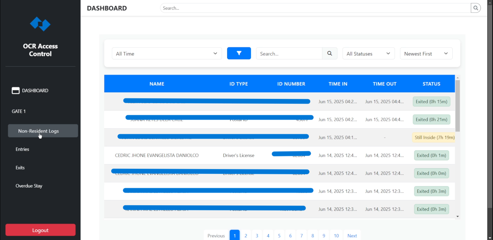

# OCR-Based Access Control System Application

## 📌 Description

The proposed OCR-Based Access Control System for Visitor Vehicle Entry in Gated Areas integrates these technologies to automate visitor verification through ID scanning. The system extracts essential data from valid IDs via OCR, and generates a unique QR code as a temporary access pass. Utilizing open-source and cost-efficient hardware, including a Raspberry Pi 4, cameras, thermal printer, and LCD display, the system provides a scalable, secure, and user-friendly solution. Its implementation is expected to reduce processing times, minimize human error, and improve both traffic flow and security in gated communities.

Developed using Python, PaddleOCR, PostgreSQL, and Firebase, the system provides efficient method to automate visitor entries in private subdivisions, offices, and other gated communities who regulates visitors by ID presentation.

---

## 🖼️ Login UI
  

    
  

## 🖼️ Dashboard UI
  

    
    
  

## 🖼️ Non-Resident Logs UI
  

    
    
  

  
---

## ✨ Features

- 📩 Real-time data synchronization using Firebase
- ⏱️ Faster and automated visitor entrance and exit for gated communities
- 📊 Intelligent ID Scanning via OCR
- ▶️ Automated QR Ticket Generation
- 📶 Seamless QR-Based Exit Verification
- ✅ Applicable for various visitor entry and exit management such as for pedestrians, visitor vehicle entry/exit, offices, schools and campuses, and gated areas.
